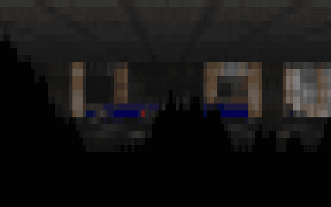

# git-doom

DOOM where **git is the display and the save system**. Every frame is a grid of
truecolor terminal "pixels" stored as a **git commit message** — the commit log is
the framebuffer and the recording. Saves are **git tags** carrying the real engine
state. A producer plays and commits; a consumer follows the log and renders.

Built on [doomgeneric](https://github.com/ozkl/doomgeneric): its platform layer is
six callbacks, and git-doom implements them so the "screen" one (`DG_DrawFrame`)
paints into git instead of a window.



> Every frame above is a git commit. [**git-doom-recording**](https://github.com/chicoxyzzy/git-doom-recording)
> is a live recording — clone it and `replay` it with git-doom.

```
┌─────────────────┐               ┌─────────────────┐               ┌─────────────────┐
│  git-doom play  │ commits frames│  data-git repo  │  reads frames │  git-doom       │
│   (producer)    │ ────────────▶ │   main branch   │ ────────────▶ │  watch / replay │
│  DOOM + input   │   tags saves  │   + save tags   │   reads saves │   (consumer)    │
└─────────────────┘               └─────────────────┘               └─────────────────┘
```

## Quick start

```sh
./git-doom build               # compile doomgeneric + the git render layer
./git-doom play                # play; renders locally and commits each frame
# …in another terminal:
./git-doom watch               # follow the main branch live
./git-doom replay 15           # replay the whole run from the start at 15 fps
```

`play` **autoscales to your terminal** (cols ≈ 3.2×rows keeps DOOM's aspect right)
and follows live resizes; pin a fixed size with `WxH` (e.g. `./git-doom play 120x40`)
to turn that off. You need a C toolchain, `git`, a **truecolor terminal**, and a
DOOM **WAD** — see [Game data](#game-data-wad) and [Portability](#portability).

## Game data (WAD)

git-doom is only the engine; DOOM's maps and textures live in a separate **IWAD**
file you provide. Any DOOM IWAD works:

- **Freedoom** — free and libre, no original game required. Grab the latest release
  from [freedoom.github.io](https://freedoom.github.io/) and unzip `freedoom1.wad`
  (Doom 1-style, episodes) or `freedoom2.wad` (Doom 2-style, MAP01+). **Recommended.**
- **DOOM shareware** — the original `doom1.wad` is freely redistributable.
- **A copy you own** — `doom.wad` / `doom2.wad` from Steam, GOG, or the old CDs.

```sh
# A) put it in the project root as doom1.wad (the name the wrapper looks for)
cp ~/Downloads/freedoom1.wad ./doom1.wad && ./git-doom play

# B) or point GITDOOM_WAD at any WAD, anywhere, under any name
GITDOOM_WAD=~/wads/DOOM2.WAD ./git-doom play
```

WADs are git-ignored (`*.wad`) — don't commit them.

Pass `-warp` to skip the title and drop straight into a level. DOOM 1 is episodic
(two numbers); DOOM 2 is flat maps (one):

| WAD | `-warp` form | example |
|---|---|---|
| **DOOM 1** — episodic (`doom1.wad`, `doom.wad`, Freedoom 1) | `-warp <ep> <map>` | `-warp 2 5` → E2M5 |
| **DOOM 2** — flat maps (`doom2.wad`, TNT, Plutonia, Freedoom 2) | `-warp <map>` | `-warp 7` → MAP07 |
| **any WAD** — skip to the first level | `-warp 1` | E1M1 / MAP01 |

## Controls

**arrow keys** or `w a s d` move/turn · `,` `.` (or `q`/`e`) strafe · `space` fire ·
`f` use/open · `1`–`7` weapon · `tab` automap · `esc` menu · `ctrl-c` quit.
Terminals can't send Ctrl/Shift/Alt as keys, so fire is `space` and there's no run
modifier.

**Save / load** is DOOM's own `esc` menu → Save Game / Load Game: pick a slot, type
a name, Enter. Each slot is kept as a `save/slotN` git tag and restored next session
— `git push` a save tag and someone else can load into the same state.

## Performance — why it can feel slow

git-doom commits **every frame** (`commit-tree` + `update-ref`), and truecolor
frames are large (tens of KB). When git can't keep up, the default is to **never
drop a frame**: the game throttles to git's commit speed — a lower but *complete*
framerate — and flushes the backlog on exit. That's why play can feel slow,
especially at large grid sizes. Trade completeness for speed:

```sh
GITDOOM_BLOCK=0  ./git-doom play   # drop frames when git lags → smooth play, lossy recording
GITDOOM_COMMIT=0 ./git-doom play   # don't record at all → full speed
```

Smaller grids and `GITDOOM_CHARSET=half` commit faster; `./git-doom gc` packs the
data repo between sessions.

## Portability

Pure POSIX C — `termios`, `poll`, `pthread`, `ioctl(TIOCGWINSZ)`, `SIGWINCH`,
`popen`, `clock_gettime`. No X11, no SDL, nothing macOS-specific.

- **macOS, Linux, BSD** — builds with `cc` (`make -f Makefile.git`) and runs.
- **Windows** — not natively (the terminal layer is POSIX); use **WSL**.
- **Runtime** — needs `git` on `PATH`, a **truecolor** terminal (for `half` mode, one
  that tiles half-blocks: iTerm2 / kitty / WezTerm), and `bash` for the wrapper.

(Developed on macOS; the code and build flags are plain Unix, so Linux/BSD should
build unchanged.)

## How it works

Short version below; the full write-up — rendering, the commit pipeline, terminal
input, and the save system — is at
**[sergey.works/git-doom](https://sergey.works/git-doom/)**.

`DG_DrawFrame` downsamples the 640×400 framebuffer to the grid and emits a truecolor
block per cell (color escapes delta-encoded; each row positioned absolutely so it
never wraps), then appends it on a background thread with `commit-tree` +
`update-ref` against a fixed empty tree — no working tree, no index. The subject is a
HUD line (`frame N | hp H | Ts`); the body is the frame. The consumer is just git and
a terminal: `watch` reprints the branch tip, `replay` walks `git rev-list --reverse`.
Saving calls `G_DoSaveGame` directly and stores the real `.dsg` (plus a thumbnail) as
a `save/slotN` tag.

## Commands & environment

| command | what |
|---|---|
| `./git-doom build` | compile the engine |
| `./git-doom play [WxH] [doom-args]` | play; render + commit every frame |
| `./git-doom watch` | follow the main branch, render the newest frame |
| `./git-doom replay [fps]` | replay the main branch from the start |
| `./git-doom saves` | list save tags |
| `./git-doom thumb <name>` | print a save's thumbnail |
| `./git-doom clean` / `gc` | remove / pack the data repo |

| env var | effect |
|---|---|
| `GITDOOM_WAD` | path to the IWAD (default `./doom1.wad`) |
| `GITDOOM_REPO` | data repo (default `./game-data`) |
| `GITDOOM_BRANCH` | branch the frames commit to (default `main`) |
| `GITDOOM_COLS` / `GITDOOM_ROWS` | pin grid size; unset = autoscale to the terminal |
| `GITDOOM_CHARSET` | `color` (default, solid `█` blocks) or `half` (`▀`, 2× vertical detail) |
| `GITDOOM_COMMIT=0` | don't record (full speed) |
| `GITDOOM_BLOCK=0` | drop frames instead of throttling |

## Notes & limitations

- **Coarse by design.** The grid is small (~160×50 cells), so it reads as DOOM but
  pixelated — the terminal is the resolution limit, not the engine.
- **`half` charset** needs a terminal that tiles half-blocks cleanly; elsewhere the
  bottom pixels can leak as horizontal lines.
- **Each match is a fresh orphan `main`** — the previous recording is discarded on
  the next `play`.
- **Saves are applied directly** (`G_DoSaveGame` / `G_DoLoadGame`), not through
  DOOM's tic/netcmd path, which doesn't run reliably here.

## Layout

```
git-doom                     # the producer/consumer CLI
doomgeneric/
  doomgeneric_git.c          # the platform layer (render + git + save/load)
  Makefile.git               # Unix build — macOS / Linux / BSD, no X11
docs/                        # GitHub Pages write-up + demo.gif
game-data/                   # generated data repo (frames + saves; git-ignored)
```
